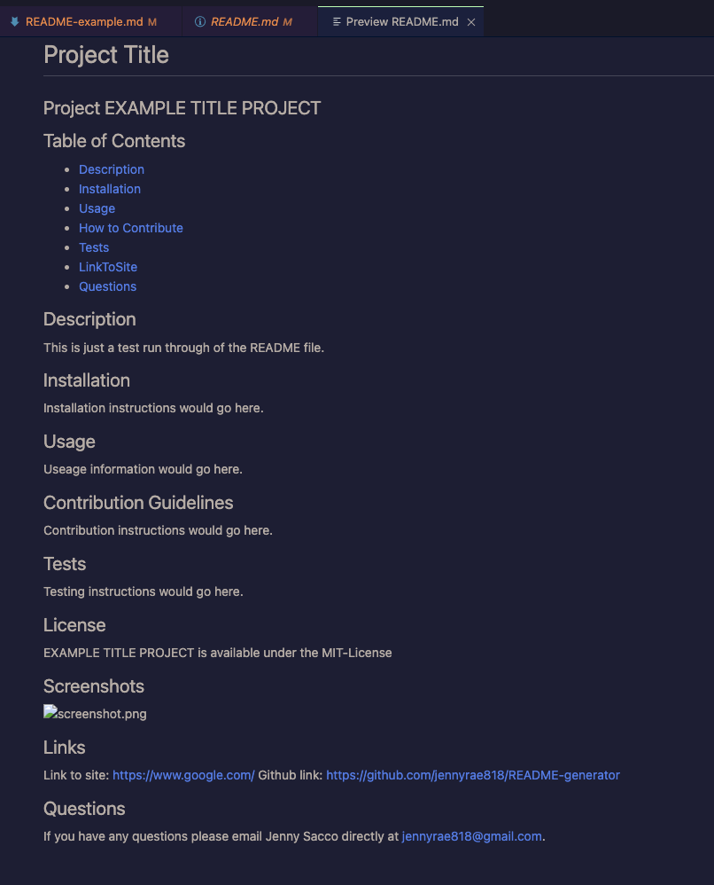
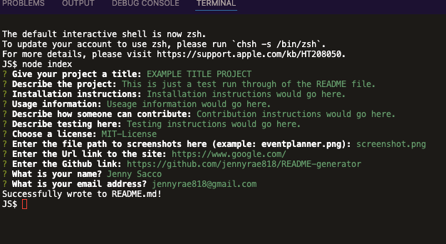

# README Generator
## <Project README Generator>

## Table of Contents 

* [Description](#description)

* [Installation](#installation)

* [Technologies Used](#technologies)

* [LinkToSite](#LinkToSite)

* [Questions](#questions)

## Description
We were tasked with making a command line application to generate a professional and high quality README file. Every project should have a README so this allows the user to quickly prompt and make a quality README file about their repository. Based on their input, a README.md file is generated with the title, description, installation, usage, license, contribution instructions, and contact information. 

## Installation 
You will need to install the dependencies, the inquirer package, run 'npm install' in your command line. Then to prompt the questions, use the command 
'node index.js'

## Technologies
node.js, inquirer package 

## LinkToSite
Video Link: https://drive.google.com/file/d/1uu7jl9qENUEswfhvBjiYylkBWzj-Fz8N/view
Github Repo Link: https://jennyrae818.github.io/README-generator/

Below is an example of what the README print out will look like based on your inputs:
 
 

 

 

## Questions

If you have any questions about the repo, open an issue or contact [Jenny Sacco](undefined) directly at jennyrae818@gmail.com.